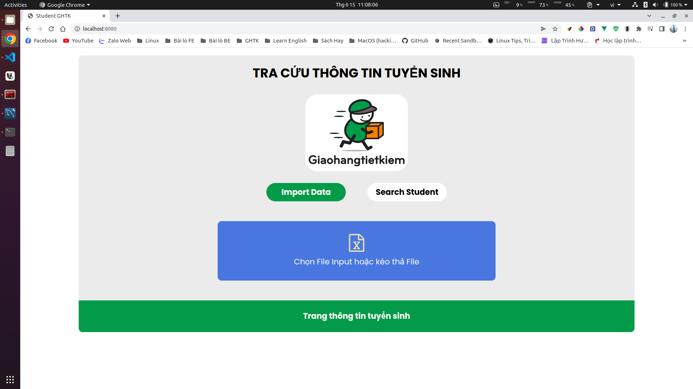
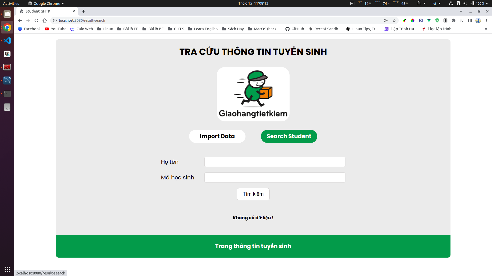
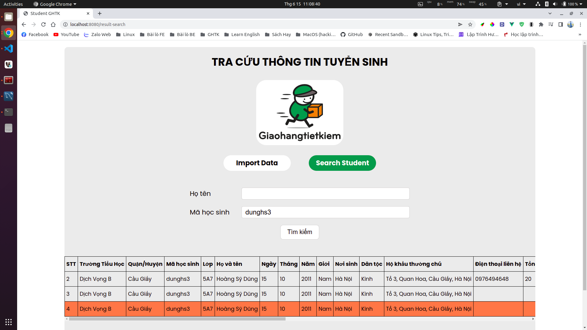
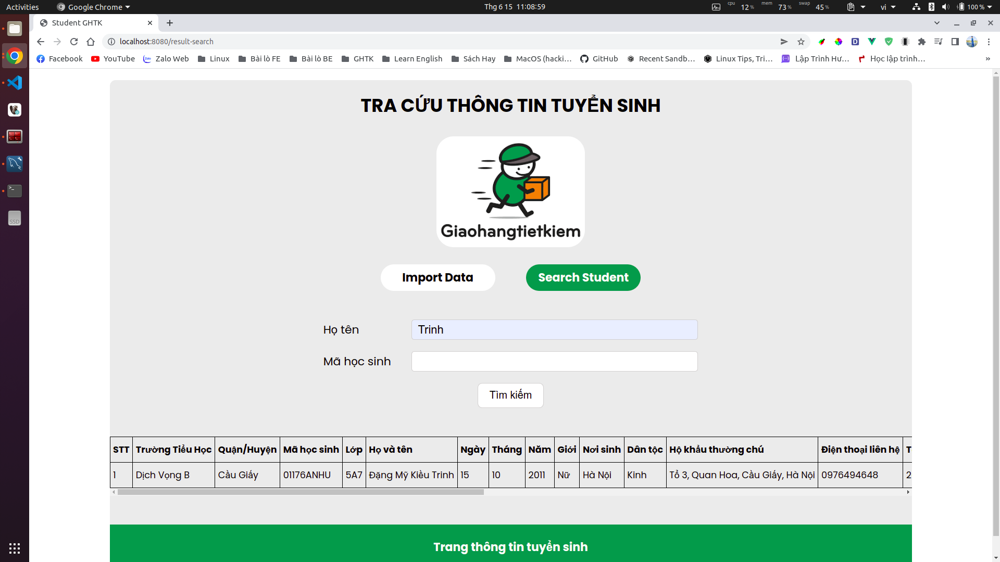

# Project GHTK Student

## Thông tin cấu hình docker-compose project: 
<ol>
    <li>Server Nginx</li>
    <li>PHP 7.4</li>
    <li>Mysql 8.0.29</li>
</ol>

#### Fontend: VueJs
#### Backend: Laravel

## Hướng dẫn setup and project:
<ol>
    <li>Clone and cd project</li>
    <li>Chạy lệnh để setup server: make setup</li>
    <li>Chạy lệnh để sử dụng: make run</li>
</ol>

#### Hình ảnh demo:

